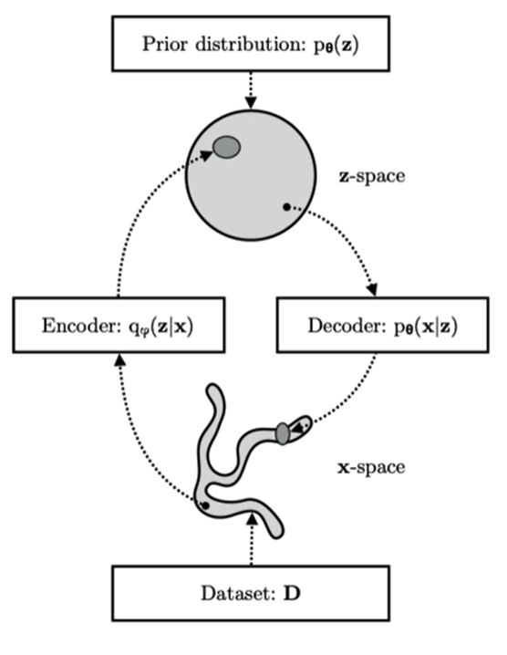
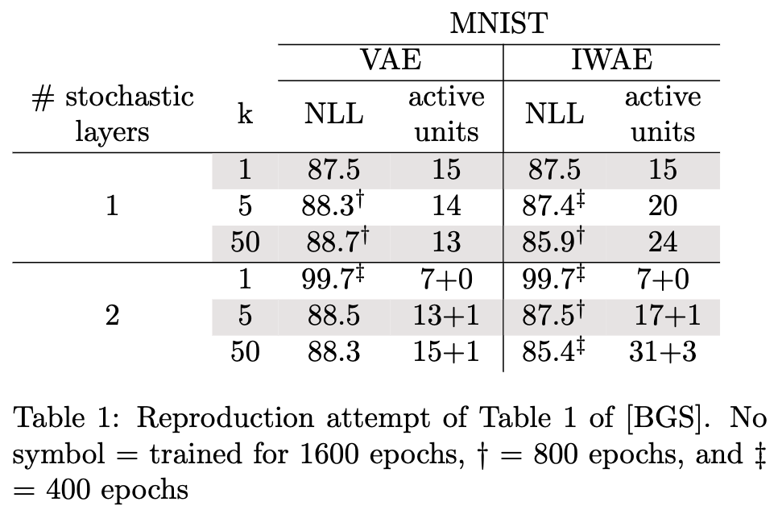

# [IWAEs](report.pdf): Importance Weighted Autoencoders Implementation
The goal of this project is to re-implement the paper by Burda et. al ”Importance Weighted Autoencoders”.

The theory behind regular Variational Autoencoders (VAE) and Importance Weighted Autoencoders (IWAE) is pre-
sented in this research, which compares and contrasts them. This paper also presents the related work done in this
field, where we analyse the results of three significant and recently released papers in the matter. In regards of the im-
plementation, we explain the methodology used such as the evaluation on density estimation, the weight initialization,
binarization, NLL, and the results of fitting a one-dimensional synthetic dataset. We can reproduce the original paper
showing that we reach similar scores. 

We also, as in the original paper, find that IWAEs are better at utilizing their
network capabilities than VAEs by learning more expressive latent representations which often results in improved
log-likelihood measurements. 

Furthermore, IWAE reaches better results than VAE on all MNIST models, as measured
by NLL and which we can generalize to all models.



# How To Run
1. ``pip install -r requirements.txt``
2. Create an experiment file with this shape inside ``src/experiments``:
```
import numpy as np

experiment = {
    'name': 'vae_k_50_layers_1',
    'seed': 123,
    'data': {
        'name': 'BinarizedMNISt',
        'batch_size': 20,
        'path': './data/',
        'num_workers': 0,
    },
    'model': {
        'type': 'VAE',
        'X_dim': 784,   # input dim
        'Z_dim': [50],    # latent dim
        'H_dim': [[200, 200]], # deterministic layer dim
        'encoder_type': 'Gaussian',
        'decoder_type': 'Bernoulli',
        'num_samples': 50,
    },
    'training': {
        'scheduler': {
            'gamma': 10 ** (-1/7),
            'milestones': np.cumsum([3 ** i for i in range(8)])
        },
        'optimizer': {
            'lr': 0.001,
            'beta1': 0.9,
            'beta2': 0.999,
            'epsilon': 1e-4
        },
        'early_stopping': {
            'patience': 4001,
            'threshold': 0.01
        },
        'total_epochs': 4001
    }
}
```
3. ``python src/main.py``
# Results

